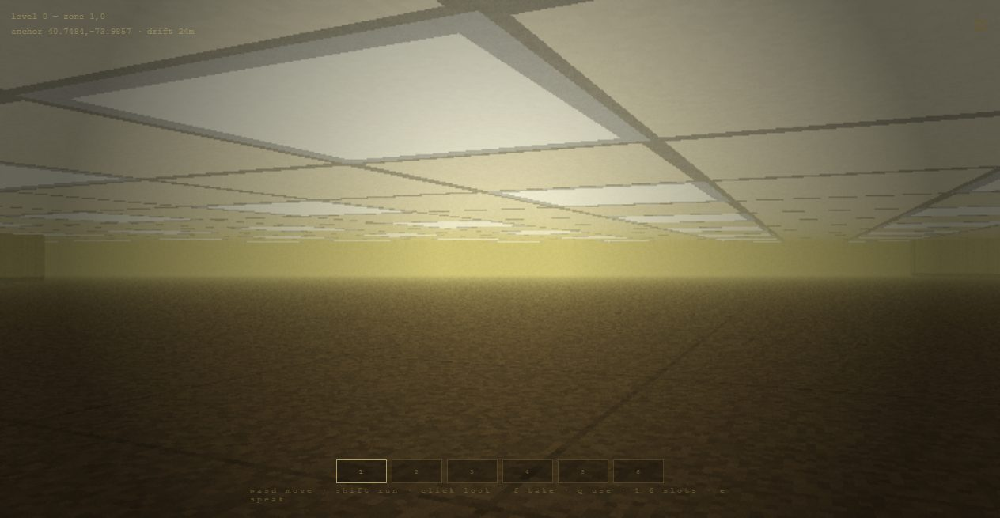
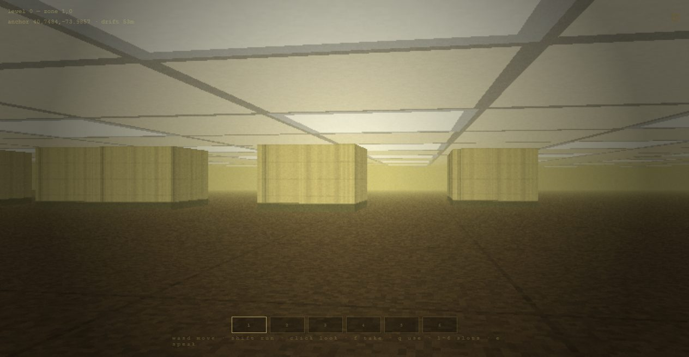
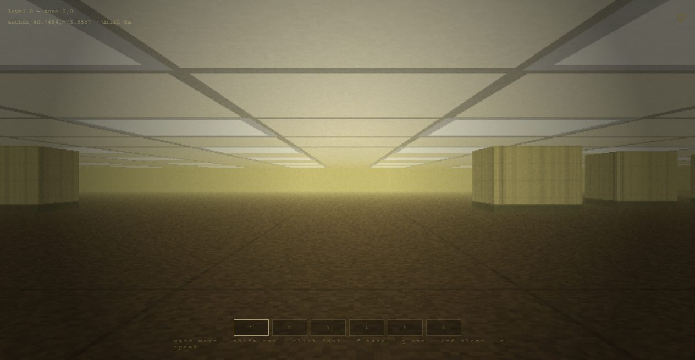
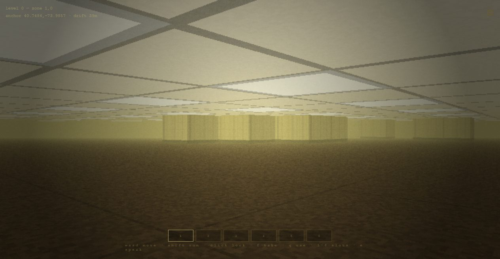
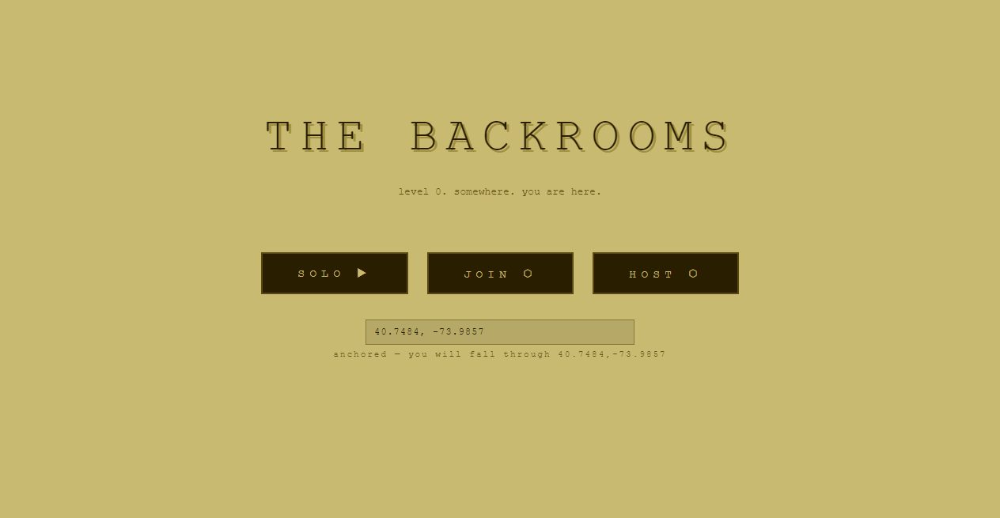

# the backrooms

> you have no-clipped out of reality.

an infinite procedural first-person horror maze that descends through four levels. fluorescent lights, damp carpet, tight office corridors, no exit — only the way down.

<p align="center">
  
</p>

<p align="center">
  
  
</p>
<p align="center">
  
  
</p>

<sub>rendered by a hand-written textured raycaster — no game engine, no assets, just math and the colour yellow.</sub>

---

## 📖 the field manual

**[open the illustrated field manual →](docs/manual.html)**

everything in one place: controls, how to read your instruments, the four-floor descent, a bestiary of what lives down there, the items, and how to play online with someone. open it in any browser.

---

## install

download the latest installer from [releases](../../releases/latest) and run it. the game auto-updates when new versions ship (you can turn that off in settings ⚙ — you'll get a quiet "restart now" prompt instead).

**windows:** `The Backrooms Setup x.x.x.exe`

---

## anchors — no-clip from a real place

on the start screen you can paste a **google maps link** (or bare `lat,lng`) into the anchor field. you will fall through *that* place. the same place always produces the same maze — for everyone. the hud tracks how far you've drifted from your body, and settings ⚙ has **locate your body**, which opens google maps at the spot where you fell through.

anchored worlds hold their shape. unanchored worlds forget you were ever there.

hosting with an anchor carries the whole room down with you — the first player into a room decides its world.

---

## items

the backrooms restocks itself. things are left lying around; walk close and press **f**.

| item | use (q) |
|------|---------|
| almond water | restores your legs, and the lights hold steady for a while |
| glowstick | pushes the fog back. temporarily. |
| bandage | patches you up — restores hit points. carry a few before you go deep. |
| polaroid camera | captures evidence — saved to `Pictures/backrooms/` |
| radio | plays a tune that is almost right. presences can be found from much farther away. other things also hear it. |

six slots. `1–6` selects, `q` uses, `x` drops. some things are worth carrying, some are worth using where you found them, some are worth leaving behind.

---

## the wish system

while wandering, you may encounter a presence — a faint shimmer in the wall.

press **e** to speak. state your request.

wishes are reviewed. some are granted. when a wish is granted, the world drifts — palette shifts, sounds change, items grow scarce or plentiful, messages grow more specific. players update and notice the world is not quite as it was.

the spirits decide. or rather, i do.

---

## controls

| key | action |
|-----|--------|
| wasd | move / strafe |
| shift | run (watch your legs) |
| arrow keys | turn (when mouse unlocked) |
| click | lock mouse for look |
| space | **ward** — shove back and disperse the things that hunt you (costs your legs) |
| f | take an item · no-clip through an exit |
| q | use selected item |
| x | drop the selected item |
| 1–6 | select inventory slot |
| e | speak to a presence |
| enter | chat (in online play) |
| m | mute / unmute the music |
| n | next track — cycle the ambient beds, or back to the floor's own song |
| esc | unlock mouse / close dialog |

your **hit points** sit under the level name, top-left. level 0 is safe; below it, the things in the fog will take them from you. bandages and time bring them back.

you are not defenceless. face a thing that hunts you and press **space** — a **ward**, a shove of will and light that throws it back and leaves it reeling, unable to reach you while it recovers. keep at it and the presence comes apart entirely. warding spends your stamina, so you cannot lean on it forever — pick your moment.

---

## settings

hit the gear ⚙ (top-right) for the control panel. everything added is optional and modular, and your choices persist between runs:

| toggle | what it does |
|--------|--------------|
| music | the generative bed on/off, plus a volume slider |
| ambience | the fluorescent hum, drone, and distant events |
| film grain / crosshair / head-bob | visual feel |
| mouse sensitivity | look speed |
| creatures | turn every entity off for pure liminal exploration |
| can take damage | off for a peaceful, no-stakes wander |

auto-update and software rendering live in the same panel.

---

## multiplayer

type your **name**, hit **PLAY ONLINE**, pick a **room code**, and share it. anyone who enters the same code falls into the same world — anywhere on the internet, no host and no port-forwarding. it runs on a small always-on Cloudflare relay (`relay/`). you see each other as pale figures with nameplates, and **press Enter to chat**.

- **PLAY ONLINE** — the public relay + a room code (the easy way).
- **JOIN LAN / HOST LAN** — the old direct-connection path (`ws://host:port` + room code) for same-network play; the standalone server ships as `backrooms-server.js` on each release (`node backrooms-server.js`, default port 8765).
- the first person into a room fixes its world; everyone else inherits it.

## save & continue

solo runs auto-save — your level, position, hit points and whole inventory — every few seconds, on every descent, and when you quit. **CONTINUE** on the title screen drops you back exactly where you left off.

---

## the world

the maze generates infinitely in every direction. chunks are cached for a small radius around you. when you travel far and return, the world may not remember what it was. it is not trying to confuse you. it simply does not care.

it is rendered with a hand-written textured raycaster — damp wallpaper, drop-ceiling tiles lit by flickering fluorescent panels, mottled carpet, film grain. no game engine, no assets, just math and the color yellow.

the sound is the same: **generative weirdcore music**, synthesised live and never looping. detuned pads breathe under a music-box melody that is almost-but-not-quite right, washed through a reverb built from noise, with tape wow-and-flutter and the occasional pitch that slides away. every level tunes it to its own mood — dreamy in the lobby, curdled below, dissonant at the bottom. no `.mp3`, no loop point; it writes itself as you walk. press **m** to silence it.

---

## the descent

the maze is no longer one endless yellow floor. it is a stack of levels, and each one has a way down. find a **no-clip exit** — a dark, breathing doorway standing in the fog — and press **f** to fall through. there is always one within a short walk; the game whispers how to find the next as you arrive.

every solo run begins outside, in **the block** — the one real place in the game.

| level | what it is | the way down |
|-------|-----------|--------------|
| **∅ — the block** | a real inner-block park in harlem park, west baltimore, under open grey sky. rowhouse backs of formstone, brick, plywood with sprayed house numbers, doors sealed with concrete, black open windows, marble stoops. some houses are lived in — a light on, nobody comes out. a plan erased the street and left this. | the front doors are sealed with block. the only way out is the gap the paperwork left — no-clip through it and fall into the lobby. **one way down.** |
| **0 — the lobby** | mono-yellow rooms, damp carpet, the fluorescent hum. safe. nothing hunts you here. | no-clip through a thin, torn corner and fall out of the lobby. |
| **1 — habitable zone** | colder concrete and dim service lights. things live here now — watch your hit points. | a hole in the floor, or a stairwell down into the pipes. |
| **2 — pipe dreams** | a maze of maintenance tunnels. steam, rust, and the dark between the pipes. bring your own light. | follow the pipes to a service hatch and drop into the dark. |
| **3 — electrical station** | a lightless labyrinth of transformers and live cable. the deepest you should go. | a door humming with current — through it, the lobby waits again. |

descend and the world changes around you: the palette, the fog, the clutter, and what is in it with you. your hit points and your inventory come with you. the floor you left does not remember you.

## building from source

```bash
npm install
npm start        # run in dev
npm test         # run unit tests
npm run dist     # build installer (requires CSC_LINK, CSC_KEY_PASSWORD env vars)
```

---

## wish pipeline (maintainer notes)

1. player submits wish in-game → github issue opens with label `wish, pending`
2. review the issue — edit the body to your interpretation if needed
3. label `granted` → action calls claude → PR opens with modified `world.json` and a patch version bump
4. review the diff, adjust if needed, merge
5. release builds automatically, players auto-update

label `denied` → bot closes with *"the spirits did not answer."*
