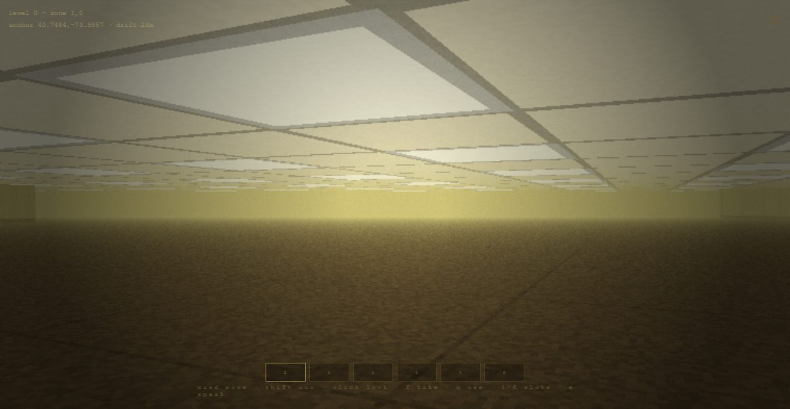
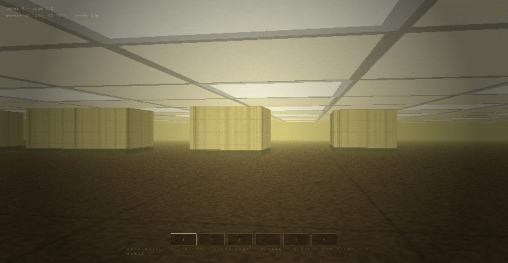
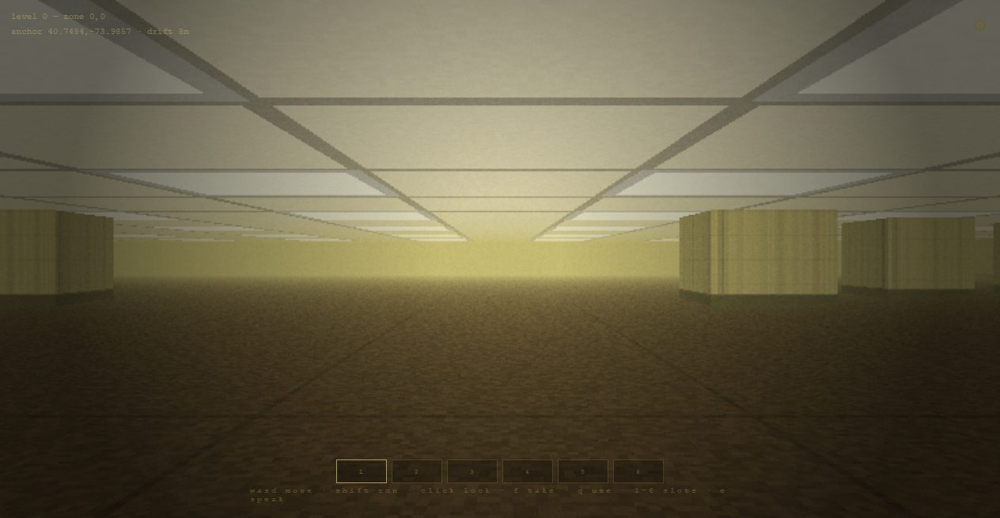
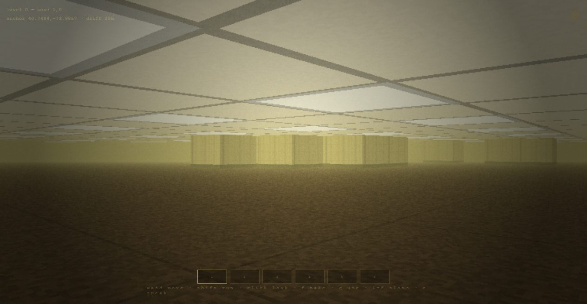
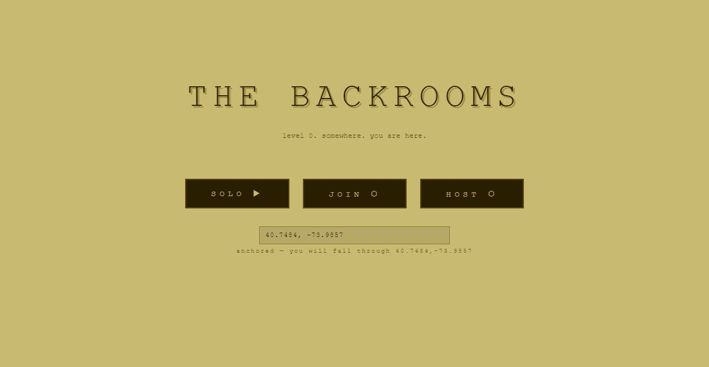

# the backrooms

> you have no-clipped out of reality.

an infinite procedural first-person horror maze that descends through four levels. fluorescent lights, damp carpet, tight office corridors, no exit — only the way down.

<p align="center">
  
</p>

<p align="center">
  
  
</p>
<p align="center">
  
  
</p>

<sub>rendered by a hand-written textured raycaster — no game engine, no assets, just math and the colour yellow.</sub>

---

## ▶ the live site — [thecornerspore.dev](https://thecornerspore.dev/)

<p align="center">
  <b><a href="https://thecornerspore.dev/">enter the finding →</a></b><br>
  <a href="https://thecornerspore.dev/play/">play in your browser</a> ·
  <a href="https://thecornerspore.dev/manual/">the field manual</a> ·
  <a href="https://thecornerspore.dev/codex/">the record — the lore</a> ·
  <a href="https://thecornerspore.dev/atlas/">the atlas</a>
</p>

> **these links render in your browser.** GitHub shows `.html` files inside this repo as *source code*, not as a page — so open the manual and the lore through the links above, not by clicking files under `docs/`.

---

## 📖 the field manual

**[open the illustrated field manual →](https://thecornerspore.dev/manual/)**

everything in one place: controls, how to read your instruments, the four-floor descent, the items, the file the office keeps on you, the beacon, and the deeper record. it renders in any browser.

---

## install

download the latest installer from [releases](../../releases/latest) and run it. the game auto-updates when new versions ship (you can turn that off in settings ⚙ — you'll get a quiet "restart now" prompt instead).

**windows:** `The Backrooms Setup x.x.x.exe`

---

## how it begins

you open your eyes outside. it is a real place — an inner-block park in west baltimore, under a flat grey sky, ringed by the backs of rowhouses whose doors have been sealed with concrete block. on a counter lies a form. your name is already on it, or a blank is where your name should be. you never filled it in.

there is one way out: a gap the paperwork left. take it and you fall into the lobby — yellow wallpaper, wet carpet, the hum. nothing hunts you there. below it, things do.

the first time you take a way down, an office somewhere above the drop ceiling writes you into a column, by how you came in. it never asks. and the backrooms reads what it wrote: how far the things can see you, what the water does to you, what a photograph develops, which sealed doors will talk.

after that it is the descent — four floors stacked in one building, a way down on each — and whatever you decide to be filed under. online, you and your friends start together in the lobby, and the file is written on all of you.

what follows is what is known. the rest is in the pages m. left lying around.

---

## anchors — no-clip from a real place

on the start screen you can paste a **google maps link** (or bare `lat,lng`) into the anchor field. you will fall through *that* place. the same place always produces the same maze — for everyone. the hud tracks how far you've drifted from your body, and settings ⚙ has **locate your body**, which opens google maps at the spot where you fell through.

anchored worlds hold their shape. unanchored worlds forget you were ever there.

hosting with an anchor carries the whole room down with you — the first player into a room decides its world. join someone else's room and the pin you pasted stays yours: the others are told only a mark, enough to know whether you fell through the same place they did.

---

## items

the backrooms restocks itself. things are left lying around, and the vending machines give one thing each; walk close and press **f**. a cabinet, a crate or a drum can be searched too — press **f** beside it and hold still a moment, and the drawer gives up what it holds.

| item | use (q) |
|------|---------|
| almond water | restores your legs and your mind; the lights hold steady and your steps go soft for a while. below the habitable zone some of it is sour, and sour water takes instead of gives |
| glowstick | pushes the fog back. temporarily — less the deeper you go. set one down and it is a breadcrumb until it gutters out |
| bandage | patches you up — restores hit points. where things hunt, wrapping it takes a slow moment, and a hit makes it slip. carry a few before you go deep. |
| polaroid camera | captures evidence — saved to `Pictures/backrooms/`. the flash makes the things reel, and the caption develops what the frame holds. point it at a friend and the film develops what the file wrote on them, and they will know |
| radio | plays a tune that is almost right. presences can be found from much farther away. other things also hear it — set it down still talking and they go to it instead of you. in the deep stacks it reads a list aloud, one group of numbers at a time |

on the deepest floors the machines sometimes give stranger things. these you keep — you cannot put them down, and they are not lost when something has you:

| find | what it is |
|------|---------|
| survey plumb | a tool, never used up. it reads the grain of the floor — slack near the top, tight and old below |
| ballast | set both feet and mean it: your legs and the lights come back. if not all of you arrived, the rest of you does |
| extension slip | *30150A.* a line the system never closed. what it says depends on what the file has written on you |

six slots. `1–6` selects, `q` uses, `x` sets it down. some things are worth carrying, some are worth using where you found them, some are worth leaving behind.

**leave a word.** when you set something down, a card asks whether to leave a word with it — six phrases lifted from the pages, m.'s and the replies left beside them. at first everyone is offered the same six for that floor and that kind of thing; once the pages you have read hold six of the twelve phrases, the card offers only words from those. *take the left.* *the dark drinks you back.* *i am close behind.* the more of the record you find, the more of it you can say. pick one (or **0** for nothing) and the thing becomes a **cache**: it lies where it fell, with an arrow for the way you were facing. whoever picks it up reads it on the card — the phrase, the arrow turned to where *they* stand, and who left it. the prompt tells you before you take it: *f · take the bandage · left by maddie*. the floor remembers your caches between visits and across a quit; online, the room sees them as you set them down, and the relay keeps the last of them for whoever comes through after you — come back to a room and your own words are still yours. a hand needs a moment between two words: set a second one down in the same breath and it stays in your hands (*your hands are not ready.*). a stranger's word steadies you, a little. no free text, ever — only what is written on the pages.

---

## the wish system

while wandering, you may encounter a presence — a faint shimmer in the wall.

press **e** to speak. state your request.

wishes are reviewed. some are granted. when a wish is granted, the world drifts — palette shifts, sounds change, items grow scarce or plentiful, messages grow more specific. players update and notice the world is not quite as it was.

the spirits decide. or rather, i do.

---

## the file

> *the file has you now.*

somewhere above the drop ceiling there is an office, and it keeps a file on everyone who falls through. you never fill it in. it fills itself in — and the backrooms reads it.

**the column.** nobody chooses one. the first way you take down, the file writes you in by how you arrived:

| how you came in | the file writes | what that means down here |
|------|---------|---------|
| alone, with a name | **tenant** — *the file has you at an address.* | the street does not mind you; the deep frays you faster. your hands find a way from further off, your map marks every way the floor has loaded, and on the block the sealed doors tell you whose address they are. |
| with an anchor | **anchored** — *the file has your body at a pin.* | the body stays where you fell through. drift too far from it and it pulls — settings ⚙ shows the *leash*. a photograph quiets it for a while. |
| with no name | **unnamed** — *the file cannot spell you.* | the things cannot keep hold of you; a page or a friend steadies you more. tell a presence *call me …* and it will ask how that is spelled. |
| first into a shared room | **processed** — *the file opened a line on you.* | the souls see the stamp. the radio reads everything to you, and once, the key. your wishes are amendments. |

and over any of them, a layer: **thin**. drop into a room someone already walks, or come back up from the dark, and *not all of you arrived*. the things lose you faster and hear you less — but the light goes through you, and a ward pushes you back as well as them. ballast cures it. until the first way down nothing is written: on the block, the form lies on the counter (**e** to read it; `/intake` reads it anywhere).

**filed under.** the file also keeps a **status**, and this one is yours to choose. it begins as a notice nobody answered. once the file can hear you — the numbers station has read you its last group, or you have found five of m.'s pages, or you are deep enough — a presence offers three stamps under the request. tap one, or type it. a file that already holds something — a closing reached, pages given up — is asked on the card first, because a new word lets go of all of it:

| status | what it turns inside out |
|------|---------|
| **extension** · *let it stay open* | the deep holds you and the street frays you. sour water stops taking anything — somewhere a line moves instead. |
| **compliance** · *close the file* | the film turns honest. a page you have not read comes **sealed**: read it, or leave it unread (**x**) and give it to the file. |
| **litigation** · *contest it* | the claim develops on every photograph, even on the dark floors. a thin figure in frame is evidence. |

the lost souls know which word you are under, and so does the room — *entered the level, filed under extension.* the office files once a day. after that it is closed until tomorrow. and the status is not part of any save: it follows you into every run, and into every room.

**three ways a file closes.** each status has its ending, and none of them is a door out.

- **extension** — on the deepest floor, after the station has read you its last group: stand in the dark, light off, still, with nothing near. while you hold it the dark does not eat you, and the lights steady to tell you it is counting. long enough, and the notice is extended over you. *twenty-two years.*
- **compliance** — give thirteen pages up unread, then tell a presence to *close the file*. each page you leave says how many the file has now, and under compliance the middle stamp at a presence becomes *close the file*, with the count beside it: tap it when the count reaches thirteen. the shimmer leaves the walls, and the floors stop leaving pages out.
- **litigation** — hold the seam. the station in the deep is counting toward something, and the extension slip names the one line the system never closed. claim it at a presence, then push it into the dark with your beacon (**b**). under litigation the held seam closes your file. under the notice nobody answered, nobody writes it down — and the seam can be held again, any run, by anyone who finds the way.

**your file** (settings ⚙) shows what the office has on you — the word you are under and since when, how the file has you, and how far your closing has come — with a **request a new notice** button that puts you back under the notice nobody answered (once a day: the old file stays closed). if the old file holds a closing or pages given up, the button asks once before it lets them go. solo or online, press **enter** and type `/status` for the same lines.

**the floors keep count.** a wish sent from a filed run carries its word with it — `filed under: EXTENSION · level 2` — and every release recounts them. a floor whose files lean one way leans with them: its machines stock for it and stamp the tray (*the tray is stamped COMPLIANCE.*), its pages and souls come more or less often, and the radio on the near floors reads the floor's roll call. who is standing on the floor with you moves it too.

---

## your instruments

top-left, under the level's name, two gauges. **hp** is your body: the things in the fog take it, and bandages and time bring it back. **san** is your mind: the dark eats at it, so does being hunted, so does a thing you cannot stop looking at — and light, sweet water, a page you have not read and a friend standing close give it back. let it run low and the edges of the screen stain, the whispers come closer together, and the floor finds more ways to frighten you. a thin bar at the bottom left is your legs; running and warding spend them.

under the gauges sits the compass: an arrow to the nearest way on that you have *seen*, and how far — or, when you have seen none, *something pulls, faintly*. a second line points back the way you came. above the item dock, a prompt says what **f** or **e** will do where you stand. the lines that fade in mid-screen are the building talking; your people talk in the chat at the lower left.

---

## controls

| key | action |
|-----|--------|
| wasd | move / strafe |
| shift | run (watch your legs) |
| arrow keys | ↑ ↓ walk · ← → turn (when the mouse is unlocked) |
| click | lock mouse for look |
| space (hold to charge) | **ward** — tap to shove the things back; hold it and your steps slow while the air tightens, then a narrower, longer push throws them farther (costs your legs) |
| f | take an item · draw from a machine · take a way — no-clip through an exit, climb a stairwell, step into the lift |
| f · search a cabinet | by a cabinet, crate, box, drum or panel: hold still for a moment and the drawer gives up what it holds — a step away leaves it; not while something is close |
| f · kneel | online, by a friend who is down: face them and press f to stay with them — your light on, holding still — and count them back. f again, a step, space or esc gets up |
| tab | the map (hold your pace) |
| q | use selected item |
| x · set down | set the selected item down where you stand, with a phrase lifted from the pages and an arrow for whoever finds it — a talking radio keeps talking where it lies |
| c · whistle | call out — a two-note whistle the floor and your friends hear; the things hear it too |
| l | flashlight on / off — go dark in a friend's light and the things see you less |
| 1–6 | select inventory slot |
| e | speak to a presence or a lost soul · read a page, or the form on the counter |
| enter | chat (in online play) — and the field console, solo too: `/status` (your file), `/intake` (the form), `/recover` · `/cases` · `/file` |
| b | fire your beacon — your own webhook, set in settings ⚙ |
| m | mute / unmute the music |
| n | next track — cycle the ambient beds, or back to the floor's own song |
| esc | unlock mouse / close dialog |

**on a phone or tablet** the left thumb has a stick (push it forward to the rim to run) and a drag anywhere else looks around. the buttons on the right are **ACT** (f), **USE** (q), **WARD** (space — hold it to charge), **SPEAK** (e), **LIGHT** (l) and **CALL** (c). tap a slot to select it, **✕** to set it down, and the paper corner marked *map* for the map. a few keys have no button yet: the beacon (**b**), the chat and the field console (**enter**) and the music (**m**, **n**) need a keyboard.

your **hit points** sit under the level name, top-left. level 0 is safe; below it, the things in the fog will take them from you. bandages and time bring them back.

you are not defenceless. face a thing that hunts you and press **space** — a **ward**, a shove of will and light that throws it back and leaves it reeling, unable to reach you while it recovers. keep at it and the presence comes apart entirely. warding spends your stamina, so you cannot lean on it forever — pick your moment.

---

## settings

hit the gear ⚙ (top-right) for the control panel — on the title screen or mid-run; esc, **CLOSE** or a click outside it puts it away. everything is optional, and your choices persist between runs:

| toggle | what it does |
|--------|--------------|
| auto-update | desktop: new versions install themselves; off, you get a quiet "restart now" prompt instead |
| software rendering | desktop: fixes freezing on some GPUs (restart to apply) |
| music | the generative bed on/off, plus a volume slider |
| ambience | the fluorescent hum, drone, and distant events, plus a volume slider |
| film grain / particles / crosshair / head-bob | visual feel — the particles are the dust, the steam and the sparks |
| mouse sensitivity | look speed (the touch drag follows it too) |
| creatures | turn every entity off for pure liminal exploration |
| solid furniture | walk around things — the chairs, crates, cabinets and machines have bodies, and so do the things in the fog; off, you pass through them as before |
| can take damage | off for a peaceful, no-stakes wander |
| graphics quality | **auto** adapts to your device; or pick low, medium or high — **classic shading** is the plainest, fastest light |
| reduce flicker | softer light dips, a gentler camera flash and less screen shake |
| frame-rate limit | none, 60 or 30 fps — saves battery and heat |
| sharp on high-DPI screens | a crisper picture on a dense display; uses more power (not with classic shading) |
| beacon effect / target | what **b** fires: off, an ntfy.sh topic, a discord webhook or your own https url |
| your file | what the office has on you, once a run is under way — the word you are under, how the file has you, how far your closing has come — and **request a new notice** |

for an anchored run the panel also shows **locate your body**, which opens google maps at the spot where you fell through (with the leash, when the file has you at a pin).

---

## multiplayer

type your **name**, hit **PLAY ONLINE**, pick a **room code**, and share it. anyone who enters the same code falls into the same world — anywhere on the internet, no host and no port-forwarding. it runs on a small always-on Cloudflare relay (`relay/`). you see each other as pale figures with nameplates, and **press Enter to chat**.

- **PLAY ONLINE** — the public relay + a room code (the easy way).
- **JOIN LAN / HOST LAN** — the old direct-connection path (`ws://host:port` + room code) for same-network play; the standalone server ships as `backrooms-server.js` on each release (`node backrooms-server.js`, default port 8765).
- the first person into a room fixes its world; everyone else inherits it.
- online, everyone starts in the lobby together, and the file writes each of you in on your first way down. drop into a room someone already walks and *not all of you arrived* — see **thin**, above.

down there you can do a few things for each other — call out, leave a word, light the way, push the dark back, photograph, count each other back. **update together:** these pass only between copies of this release; an older copy still walks beside you, drawn as a plain figure, but it hears none of them. on **PLAY ONLINE** they ride one new kind of message the public relay has to carry, so a room on a relay that has not been updated plays as it always did — walking, chat and nameplates, nothing more. **HOST LAN** from this release carries them from the start.

**the whistle (c).** call out, and everyone on your floor hears two notes at a pitch that is only yours — panned to where you stand, fainter the farther you are, with a line in their chat that says *near* or *far* and which way. the hall counts who has answered lately and tells you, in words: *two of you, counting yourself.* a friend standing beside you who has not whistled back yet is not counted — *nobody has answered yet.* a friend who goes a minute and a half without a whistle, a word, or standing near you has gone quiet, and you will feel it. alone, the hall keeps the sound. sometimes it does not, and the pitch that answers is wrong. the things hear every call — a whistle carries further than a ward. on a phone it is the **CALL** button.

**a friend's light (l).** the things see by light. once you have taken your first way down, stand dark in a friend's flashlight — a few steps from them, nothing between you — and the things in the fog have a harder time finding you, and the dark eats at you slower. if not all of you arrived, it gives your mind nothing — the light goes through you. the game names whose light it is when you go dark in it. their light helps the people standing in it, never the one carrying it.

**push for each other (space).** the things are not the same things on every screen. when a friend wards, everyone on that floor feels it where the friend stands: what was in front of them reels, or comes apart, on your side too — and if you were standing in front of their push when it met something, it steadies you. *maddie pushes the dark off you.*

**evidence (the polaroid).** photograph a friend and the film develops what the file wrote on them — and the photograph reaches them. *someone has evidence of you. you are harder to erase.* for a minute and a half their mind will not sink below a quarter, and the others see them solid, however thin they have become. photograph a friend who is down and they are counted back at once.

**down, not dead.** with a friend on your floor, a hit that would kill you lays you **down** instead: your light goes out and you have twenty-five seconds in the dark. you can still whistle. a friend who finds you, faces you and presses **f** stays with you — light on, holding still — and counts you back. a photograph does it faster. if nobody comes, it is a death — and a friend who is down too cannot come: when everyone on the floor is lying down, the hit kills you as it always did.

## save & continue

solo runs auto-save — your level, position, hit points and whole inventory, what every floor remembers of you, the words you left with things, who the file has you as, and the sheets of your map — every few seconds, on every descent, and when you quit. **CONTINUE** on the title screen drops you back exactly where you left off. the status you are filed under is not in the save at all: it is the office's, and it follows you into every run and every room. online runs are not saved; the room keeps its world, and you fall back into it.

---

## the world

the maze generates infinitely in every direction. chunks are cached for a small radius around you. when you travel far and return, the world may not remember what it was. it is not trying to confuse you. it simply does not care.

it is rendered with a hand-written textured raycaster — damp wallpaper, drop-ceiling tiles lit by flickering fluorescent panels, mottled carpet, film grain. no game engine, no assets, just math and the color yellow.

the sound is the same: **generative weirdcore music**, synthesised live and never looping. detuned pads breathe under a music-box melody that is almost-but-not-quite right, washed through a reverb built from noise, with tape wow-and-flutter and the occasional pitch that slides away. every level tunes it to its own mood — dreamy in the lobby, curdled below, dissonant at the bottom. no `.mp3`, no loop point; it writes itself as you walk. press **m** to silence it.

---

## the descent

the maze is no longer one endless yellow floor. it is a stack of levels, and each one has a way down. find a **no-clip exit** — a dark, breathing doorway standing in the fog — and press **f** to fall through. there is always one within a short walk; the game whispers how to find the next as you arrive.

every solo run begins outside, in **the block** — the one real place in the game.

| level | what it is | the way down |
|-------|-----------|--------------|
| **∅ — the block** | a real inner-block park in harlem park, west baltimore, under open grey sky. rowhouse backs of formstone, brick, plywood with sprayed house numbers, doors sealed with concrete, black open windows, marble stoops. some houses are lived in — a light on, nobody comes out. a plan erased the street and left this. | the front doors are sealed with block. the only way out is the gap the paperwork left — no-clip through it and fall into the lobby. **one way down.** |
| **0 — the lobby** | mono-yellow rooms, damp carpet, the fluorescent hum. safe. nothing hunts you here. | no-clip through a thin, torn corner and fall out of the lobby. |
| **1 — habitable zone** | colder concrete and dim service lights. things live here now — watch your hit points. | a hole in the floor, or a stairwell down into the pipes. |
| **2 — pipe dreams** | a maze of maintenance tunnels. steam, rust, and the dark between the pipes. bring your own light. | follow the pipes to a service hatch and drop into the dark. |
| **3 — electrical station** | a lightless labyrinth of transformers and live cable. the deepest you should go. | a door humming with current — through it, the lobby waits again. |

descend and the world changes around you: the palette, the fog, the clutter, and what is in it with you. your hit points and your inventory come with you.

the floors are stacked in one building. under some holes there is a **stairwell up**, back to the floor you fell from, a few rooms over from where you landed; and somewhere on level 1 a **lift** stands, uncalled — it only goes one place, and it does not come back for you. the floor you left remembers you: what you took stays taken, what you set down lies where you left it, and a machine you emptied clunks again only after you have been away a while. press **tab** for the map — a sheet of pencil strokes for what you have walked and small glyphs for what you have seen, held while you keep moving at half pace. and when something finally has you, you do not wake where you fell in: you wake a floor above, beside the hole you fell through, lighter — whatever was in your hand is gone, your ceiling a little lower, the trays empty for that visit.

## building from source

```bash
npm install
npm start        # run in dev
npm test         # run unit tests
npm run dist     # build installer (requires CSC_LINK, CSC_KEY_PASSWORD env vars)
```

---

## the relay (maintainer notes)

every co-op verb (the whistle, a cache and its taking, the kneel, a friend's ward, a photograph, the `here` heartbeat) rides one relayed message type, `ev`. a release that adds or changes one needs the relay redeployed with it (`cd relay && npx wrangler deploy`), or PLAY ONLINE rooms will not carry it. decide the keep/drop log on purpose: the relay keeps the last caches a room set down for whoever joins later — in the room's memory, so a room that sleeps forgets them — unless its `EV_LOG` var is `'0'`; the standalone node server (`node backrooms-server.js`) keeps them only with `--evlog` or `EV_LOG=1`, and HOST LAN only when the app was started with `EV_LOG=1`.

---

## wish pipeline (maintainer notes)

1. player submits wish in-game → github issue opens with label `wish, pending`
2. review the issue — edit the body to your interpretation if needed
3. label `granted` → action calls claude → PR opens with modified `world.json` and a patch version bump
4. review the diff, adjust if needed, merge
5. release builds automatically, players auto-update

label `denied` → bot closes with *"the spirits did not answer."*
